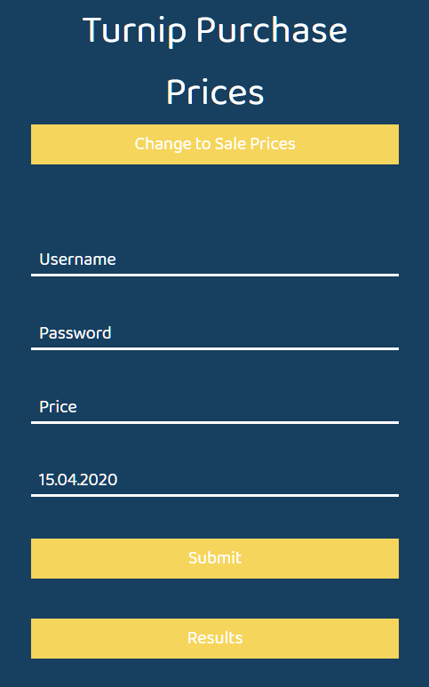
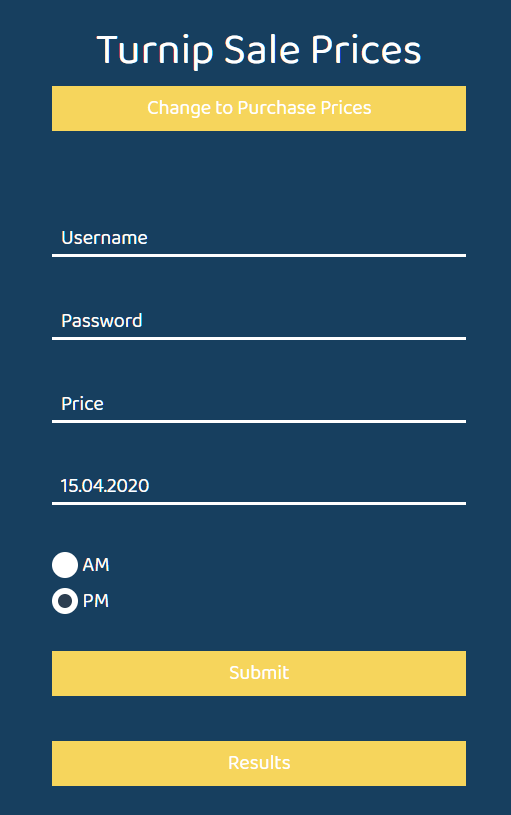
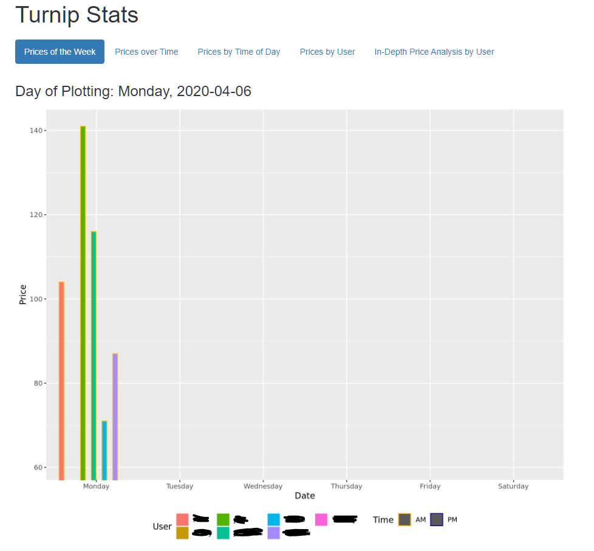
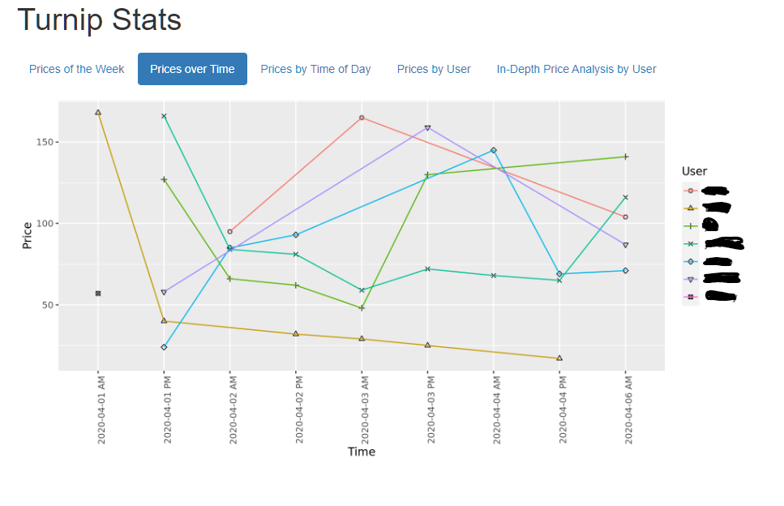
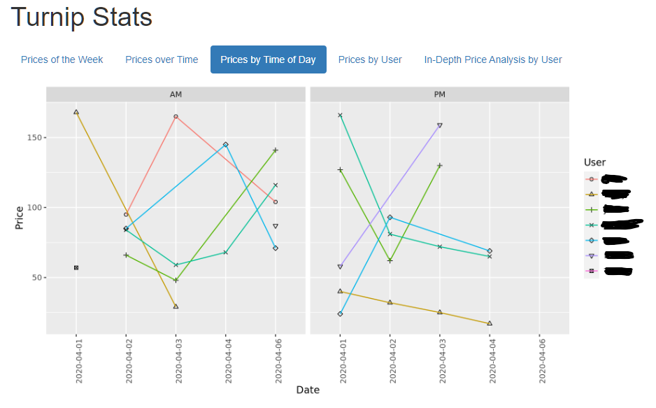
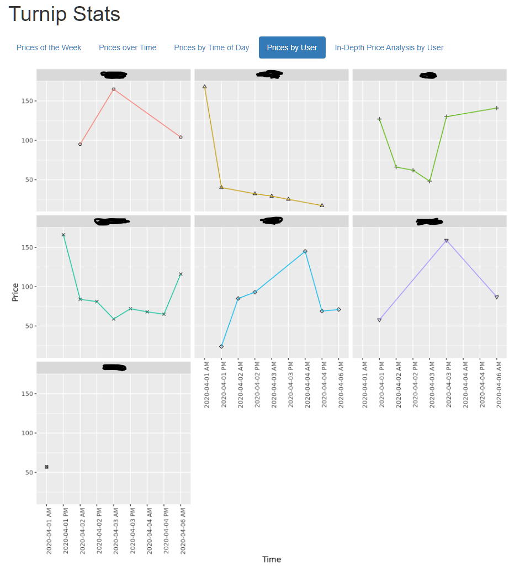
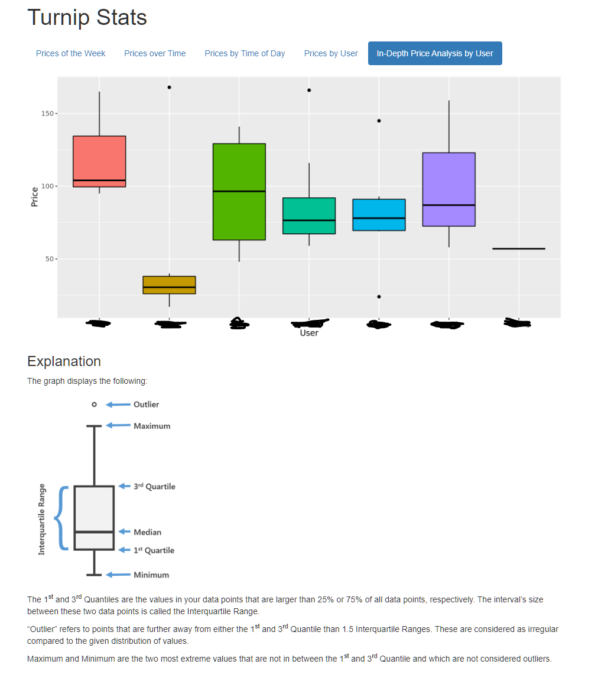
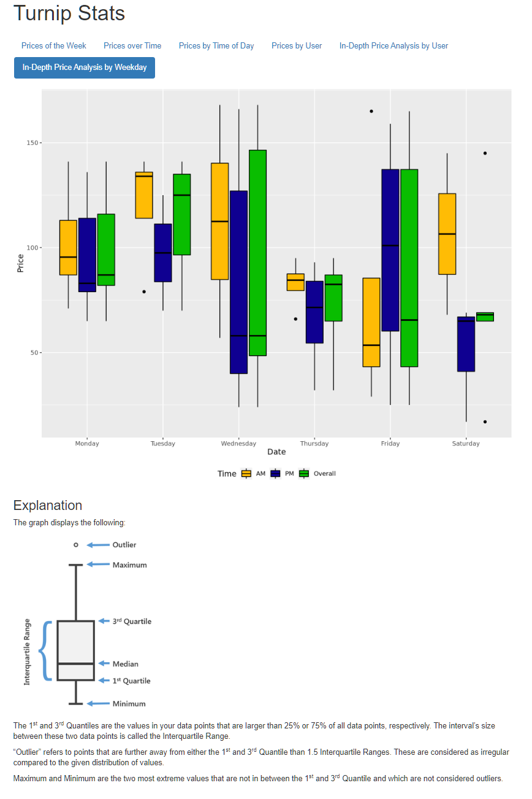
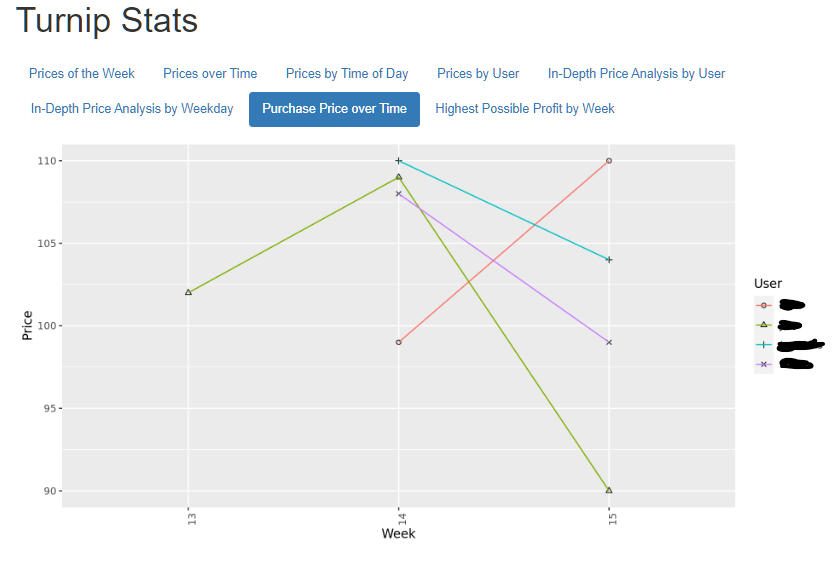
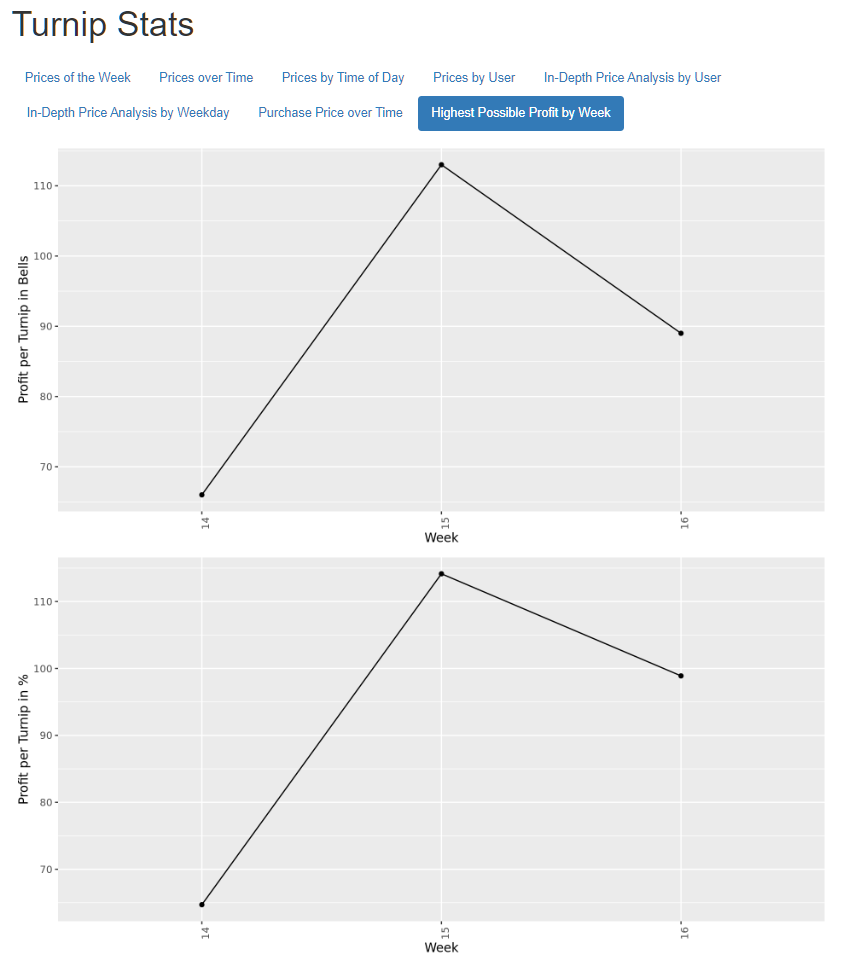

# TurnipStats
Turnip Statistics for Animal Crossing: New Horizons' Stalk Market

This project is a basic approach to visualise data from turnip prices for multiple users and host it on the web.

## Requirements

* MySQL
* PHP
* R 
  - RMarkdown
  - tidyr
  - ggplot2
  - knitr
  - reshape2
  - RMySQL
* Javascript
  - JQuery

## Setup

1. 

   - Create a new table called `SaleStats` in your database as following:

     | ID | User | Price | Date | Time |
     | --- | --- | --- | --- | --- |
     | INT | TEXT | INT | DATE | BOOLEAN |

      Make ID your primary key.

   - Create a new table called `PurchaseStats` in your database as following:

     | ID | User | Price | Week |
     | --- | --- | --- | --- |
     | INT | TEXT | INT | INT |

      Make ID your primary key.

2. Put your database info into the `form_handler.php` and `TurnipStats.Rmd` files

3. Set up account credentials in the `form_handler.php`

4. Add the correct absolute path to `knit.sh` in `form_handler.php`

5. Add the correct path to your `jquery.min.js` in `index.html`

6. Add an exception for the `knit.sh` so it can be called with `sudo` by the `www-data` user without a password:
   - Call `visudo` from the command line
   - At the bottom, add `www-data ALL=NOPASSWD: /full/path/to/directory/knit.sh`
   - Save file

7. Make `knit.sh` immutable by calling `chattr +i knit.sh`

## Screenshots

## Special Thanks

Thanks to adam2326 from CodePen (https://codepen.io/adam2326) for Fancy Forms which was adapted for this project
