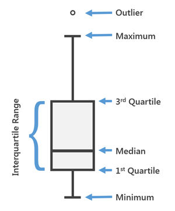

```{r setup, include=FALSE, message=FALSE, warning=FALSE}
knitr::opts_chunk$set(echo = TRUE)
```


```{r, echo=FALSE, message=FALSE, warning=FALSE}
library(RMySQL)
mydb = dbConnect(MySQL(), user="user", password="password", dbname="dbName", host="127.0.0.1")
rs = dbSendQuery(mydb, "SELECT * FROM TurnipStats")
data = fetch(rs, n=-1)
data$User <- factor(data$User)
library(ggplot2)
library(tidyr)

data$Time <- as.character(data$Time)
data$Time[data$Time=="0"] <- "AM"
data$Time[data$Time=="1"] <- "PM"

data2 <- unite(data, "Time", Date, Time, sep=" ",)

data3 <- data.frame(data)
data3$Date <- as.Date(data3$Date)
today <- Sys.Date()
offset_day <- as.POSIXlt(today)$wday -1
if (offset_day==-1) {
	offset_day=6
	}
data3 <- data3[data3$Date>= (today-offset_day),]
data3$Date <- c("Sunday", "Monday", "Tuesday", "Wednesday", "Thursday", 
    "Friday", "Saturday")[as.POSIXlt(data3$Date)$wday + 1]
data3$Date <- factor(data3$Date, levels=c("Monday", "Tuesday", "Wednesday", "Thursday", 
    "Friday", "Saturday", "Sunday"))
expanding <- expand.grid(Date =factor(c("Monday","Tuesday","Wednesday","Thursday","Friday","Saturday"), levels=c("Monday", "Tuesday", "Wednesday", "Thursday", 
    "Friday", "Saturday")), User= unique(data$User), Time=c("AM","PM"))
data3 <- merge(data3, expanding, all=T)
```
# {.tabset .tabset-pills}

## Prices of the Week

```{r, echo=FALSE, message=FALSE, warning=FALSE, fig.width=10}
date_to_print <- paste0(c("Sunday", "Monday", "Tuesday", "Wednesday", "Thursday", 
    "Friday", "Saturday")[as.POSIXlt(today)$wday + 1],", ",today)
```

###Day of Plotting: `r date_to_print`

```{r, echo=FALSE, message=FALSE, warning=FALSE, fig.width=10, fig.height=8}
ggplot(data3,aes(Date, Price, group=interaction(Time,User))) + geom_bar(position="dodge2", stat="identity", aes(colour=Time, fill=User))+ scale_colour_manual(values=c("#ffbc05","#0f0091")) + theme(legend.position="bottom")
```


## Prices over Time

```{r, echo=FALSE, message=FALSE, warning=FALSE, fig.width= 10}
ggplot(data2,aes(Time, Price, group=User)) + geom_point(aes(shape=User))+geom_line(aes(colour=User)) + theme(axis.text.x = element_text(angle = 90, hjust = 1)) + scale_shape_manual(values=1:nlevels(data2$User))
```


## Prices by Time of Day

```{r, echo=FALSE, message=FALSE, warning=FALSE, fig.width= 10}
ggplot(data,aes(Date, Price, group=User)) + geom_point(aes(shape=User))+geom_line(aes(colour=User))+facet_grid(.~Time) + theme(axis.text.x = element_text(angle = 90, hjust = 1)) + scale_shape_manual(values=1:nlevels(data$User))
```


## Prices by User

```{r, echo=FALSE, message=FALSE, warning=FALSE, fig.width= 10, fig.height= 10}
ggplot(data2,aes(Time, Price, group=User)) + geom_point(aes(shape=User))+geom_line(aes(colour=User))+facet_wrap(.~User) + theme(axis.text.x = element_text(angle = 90, hjust = 1)) + scale_shape_manual(values=1:nlevels(data2$User))
```


## In-Depth Price Analysis by User

```{r, echo=FALSE, message=FALSE, warning=FALSE, fig.width= 10}
ggplot(data, aes(User, Price)) + geom_boxplot(aes(fill=User), color="black")+guides(fill="none")
```

### Explanation 

The graph displays the following:


```{r, echo=FALSE, message=FALSE, warning=FALSE, out.width="30%"}
library(knitr)

```

The 1^st^ and 3^rd^ Quantiles are the values in your data points that are larger than 25% or 75% of all data points, respectively. The interval size of these two data points is called the Interquartile Range.

"Outlier" refers to points that are further away from either the 1^st^ and 3^rd^ Quantile than 1.5 Interquartile Ranges. These are considered as irregular compared to the given distribution of values.

Maximum and Minimum are the extreme values that are not inside the 1^st^ and 3^rd^ Quantile and which are not considered outliers.
